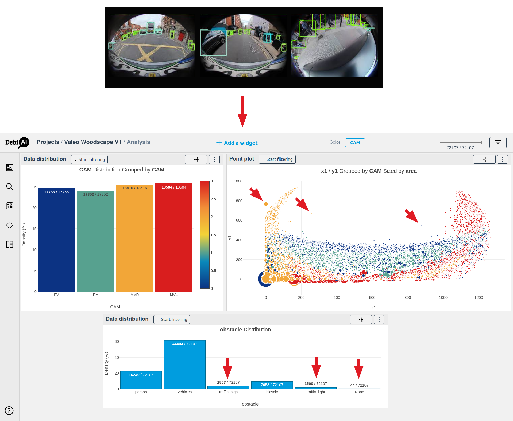

<div align="center">
    

[](https://debiai.irt-systemx.fr/)
</br>
[](https://opensource.org/licenses/Apache-2.0)

</br>


</br>
[](https://github.com/psf/black)
[](https://flake8.pycqa.org/en/latest/)
[](https://github.com/prettier/prettier)

</div>

## Why DebiAI?

DebiAI is an open-source web application that aims to facilitate the process of developing Machine Learning models, especially in the stage of the project data analysis and the model performance comparison.

DebiAI provides data scientists with features to:

- Identify biases and errors in your input, results, contextual or ground truth project data
- Make a comparison of the performance of your ML according to their contextual results
- Select and create sets of data graphically for further analysis or (re-)training purposes
- Quickly create and share statistical visualizations of your project data for your team or client

## Documentation

The full documentation is available on the [DebiAI website](https://debiai.irt-systemx.fr/).

## Dashboard

DebiAI has a Web Graphical User Interface with a complete data visualization toolkit offering many statistical analysis tools:

<p align="center">
  
</p>

The dashboard is highly customizable and can be used for large and small projects. Learn more about the [widgets and how to use them](https://debiai.irt-systemx.fr/dashboard/widgets/).

## Data

DebiAI is designed to be used for any kind of projects and data, it is particularly useful for projects that involve many contextual data.

DebiAI provide two main ways to import your data:

- A [DebiAI Python module](https://debiai.irt-systemx.fr/dataInsertion/pythonModule/) is provided to insert, directly from your Python workflow, the data and model results that you want to study.
- You can also create a [Data Provider](https://debiai.irt-systemx.fr/dataInsertion/dataProviders/), a Web API that will allow DebiAI to reach your data and model results from any programming language and any data sources without duplication.
  Check out the [DebiAI Data Provider Node.js template](https://github.com/debiai/data-provider-nodejs-template) for an example of a Data Provider.

## Installation

DebiAI is available with pip or as a Docker image. To install it, you can follow the [installation guide](https://debiai.irt-systemx.fr/introduction/gettingStarted/installation).

## Use cases

As part of the [Confiance.ai](https://www.confiance.ai/) program, we (the [IRT SystemX](https://www.irt-systemx.fr/)) are using and developing DebiAI for a wide range of use cases.

One of them is the [Valeo - WoodScape](https://woodscape.valeo.com/) dataset:

### Valeo - WoodScape

The Valeo - WoodScape dataset is an annotated image dataset taken from 4 fisheye cameras. DebiAI is used to analyze the dataset for biases and outliers in the data.

<p align="center">
  
</p>

Within the [Confiance.ai](https://www.confiance.ai/) program, DebiAI has been able to import the project data, detect biases, find annotations errors and export them to the project's image annotation tool.

## Scientific publications

- ICAS 2024 [DebiAI: Open-Source Toolkit for Data Analysis, Visualization and Evaluation in Machine Learning](https://hal.science/hal-04446930).
  - [Best paper award](https://www.iaria.org/conferences2024/AwardsICAS24.html)! 🏆

## Citation

If you use DebiAI in your research, please cite the following paper:

<!-- cSpell:disable -->

```
@inproceedings{mansion2024debiai,
  title={DebiAI: Open-Source Toolkit for Data Analysis, Visualisation and Evaluation in Machine Learning},
  author={Mansion, Tom and Braud, Rapha{\"e}l and Amrani, Ahmed and Chaouche, Sabrina and Adjed, Faouzi and Cantat, Lo{\"\i}c},
  booktitle={ICAS 2024},
  year={2024}
}
```

<!-- cSpell:enable -->

---

<p align="center">
  DebiAI is developed by 
  <a href="https://www.irt-systemx.fr/" title="IRT SystemX">
   
  </a>
  And is integrated in 
  <a href="https://www.confiance.ai/" title="Confiance.ai">
   
  </a>
</p>

---
